# 7. Database ER diagram

## Mermaid

```mermaid
erDiagram
    ORGANIZATIONS ||--o{ USERS : employs
    ORGANIZATIONS ||--o{ TEAMS : contains
    ORGANIZATIONS ||--o{ SKILLS : defines
    ORGANIZATIONS ||--o{ LABELS : defines
    ORGANIZATIONS ||--o{ HOLIDAYS : observes
    ORGANIZATIONS ||--o{ RETENTION_POLICIES : configures
    ORGANIZATIONS ||--o{ AUDIT_LOGS : records
    ORGANIZATIONS ||--o{ CONVERSATIONS : hosts

    USERS ||--o{ USERS : "manages (manager_id)"
    USERS ||--o{ REFRESH_TOKENS : authenticates
    USERS ||--o{ USER_SKILLS : has
    SKILLS ||--o{ USER_SKILLS : "held by"
    USERS ||--o{ TEAM_MEMBERS : "belongs to"
    TEAMS ||--o{ TEAM_MEMBERS : includes
    USERS ||--o{ TEAMS : "manages (manager_id)"

    TEAMS ||--o{ TASKS : owns
    TASKS ||--o{ TASKS : "parent of (subtasks)"
    TASKS ||--o{ TASK_ASSIGNEES : "assigned via"
    USERS ||--o{ TASK_ASSIGNEES : "assigned to"
    TASKS ||--o{ ASSIGNMENT_EVENTS : "history of"
    TASKS ||--o{ TASK_LABELS : tagged
    LABELS ||--o{ TASK_LABELS : tags
    TASKS ||--o{ TASK_DEPENDENCIES : "depends on"
    TASKS ||--o{ TASK_COMMENTS : discusses
    TASKS ||--o{ TASK_ACTIVITY : "changed by"
    TASKS ||--o{ WORK_LOGS : "time against"
    USERS ||--o{ WORK_LOGS : logs

    USERS ||--o{ CAPACITY_WEEKS : "overrides capacity"
    USERS ||--o{ LEAVE_REQUESTS : requests
    USERS ||--o{ LEAVE_REQUESTS : "decides (decided_by)"

    CONVERSATIONS ||--o{ CONVERSATION_MEMBERS : includes
    USERS ||--o{ CONVERSATION_MEMBERS : joins
    CONVERSATIONS ||--|| DM_PAIRS : "uniquely identifies a DM"
    CONVERSATIONS ||--o{ CONVERSATION_TASK_LINKS : "linked to work"
    TASKS ||--o{ CONVERSATION_TASK_LINKS : "discussed in"
    CONVERSATIONS ||--o{ MESSAGES : contains
    MESSAGES ||--o{ MESSAGES : "parent of (thread)"
    USERS ||--o{ MESSAGES : writes
    MESSAGES ||--o{ MESSAGE_REACTIONS : receives
    USERS ||--o{ MESSAGE_REACTIONS : reacts
    MESSAGES ||--o{ MESSAGE_READS : "read by"
    USERS ||--o{ MESSAGE_READS : reads

    MESSAGES ||--o{ ATTACHMENTS : carries
    TASKS ||--o{ ATTACHMENTS : carries
    TASK_COMMENTS ||--o{ ATTACHMENTS : carries

    USERS ||--o{ NOTIFICATIONS : receives
    USERS ||--o{ NOTIFICATION_PREFERENCES : configures
    USERS ||--o{ AUDIT_LOGS : "acted (actor_id)"
```

## Reading the diagram

**The reporting line is inside `users`.** `manager_id` is a self-reference, and
"my reportees" is a recursive walk down it. This keeps a manager's scope a
property of the person rather than a separate hierarchy table that could drift
out of sync with the org chart.

**Capacity is computed, never stored as a total.** There is no
`utilization` column anywhere. It is derived at read time from
`users.weekly_capacity_hours` (optionally overridden per week in
`capacity_weeks`), minus `leave_requests` and `holidays`, against the sum of
open `task_assignees.allocated_hours`. Storing a derived total would guarantee
that some code path eventually forgets to update it.

**`messages` is range-partitioned by month.** Its primary key is
`(id, created_at)` because a partitioned table must carry its partition key in
the key. Everything referencing a message (`message_reactions`,
`message_reads`, `attachments`) therefore holds a composite
`(message_id, message_created_at)` foreign key. The payoff is that 365-day
retention becomes `DETACH PARTITION` + `DROP TABLE` rather than a bulk delete.

**`messages.parent_message_id` is deliberately not a foreign key.** A
self-referencing FK on a partitioned table would require every reply to carry
its parent's `created_at`, which is a denormalisation with no other purpose.
The service layer validates that a parent exists in the same conversation; the
integration suite covers it.

**`dm_pairs` exists to make a constraint possible.** "One DM per pair of
people" cannot be expressed on `conversations` alone. Storing the sorted pair
with a unique primary key means two people clicking each other simultaneously
still end up in one conversation, enforced by the database rather than by
hopeful application code.

**Assignment history is separate from current assignment.**
`task_assignees` is the present; `assignment_events` is the past, appended and
never rewritten, which is what the assignment-history report reads.

## Cardinality notes

| Relationship | Cardinality | Enforced by |
|---|---|---|
| user → organization | many-to-one | FK, cascade delete |
| user → manager | many-to-one, nullable, acyclic | FK + recursive check in the service |
| team → manager | many-to-one, `ON DELETE RESTRICT` | A team always has an owner |
| task → team | many-to-one | FK, cascade |
| task → parent task | many-to-one, max depth 1 | FK + service check |
| task ↔ user | many-to-many | `task_assignees` |
| task ↔ task | many-to-many, acyclic for `blocks` | `task_dependencies` + recursive cycle check |
| conversation ↔ user | many-to-many | `conversation_members` |
| message → parent | many-to-one | Service-validated (see above) |
| attachment → owner | exactly one of message/task/comment | `CHECK` constraint |
